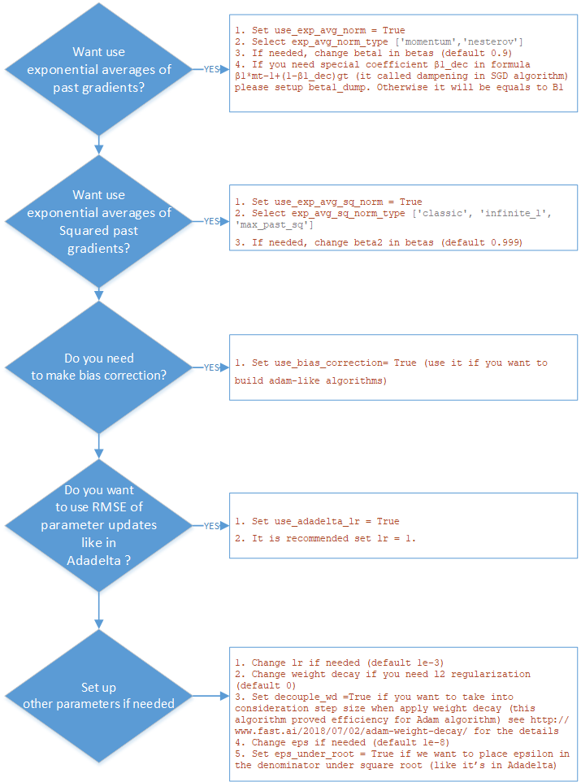

# Universal gradient descent optimizer for PyTorch

The repository contains script with universal gradient descent optimizer
for PyTorch 0.4. Actually, PyTorch contains a lot of different classes
for optimizers though some of them are very similar. With help of this
optimizer we can construct the majority of existent optimizers like:

1.  SGD (classic, with momentum or with Nesterov momentum)

2.  Rmsprop

3.  Adadelta

4.  Adam-like optimizers (Adam, Adamax, Nadam, AdamW, Adam with amsgrad)

Additionally, we can combine the input parameters and build non standard
optimizer.

## How it works

If we review the principles of main gradient descent optimizers, we can
derive the following general formulas for parameters update:

$$)

Where:

-   t- number of time step

-    - parameters to update (t+1 –step we
    want to do)

-   _lr_ – learning rate

-   _bias_corr_ – bias correction. In standard algorithms, it applies
    in Adam optimizer when we correct exponential averages of past and
    past squared gradients (make transition from
     and from
     respectively). In other cases we
    can set it equals to 1

-    – root mean
    squared error of parameter updates, use instead of learning rate in
    Adadelta algorithm. Could be 1 if we don’t use it

-    - exponential averages of past gradients. Can be momentum
    (SGD with momentum, Adam), or nesterov momentum (SGD with nesterov
    momentum, Nadam)

-    – calculated gradient. Use in case if we don’t use
    exponential averages of past gradients (classical SGD)

-    - exponential averages of past squared gradients. Can be
    classical (Adadelta, Adam, RMSProp), use infinite ℓ-norm (Adamax) or
    use the maximum of past squared gradients $v_{t}$rather than the
    exponential average (Adam with amsgrad)

-    – small constant number (like 1-e7) to avoid zero
    division

In proposed solution, all formula components are parametrized and we can
be build existent optimizer or make an experiment and build for example
Adam with Adadelta learning rate parameter.

## Algorithm for setting up the optimizer

Below is the schema how to set up optimizer:

**Requirements**

-   Python 3

-   Pytorch 0.4

## Quick Start

1.  Copy script in the directory of your project

2.  To use the extension:

` from uoptim import UOptimizer`

## Testing

-   To prove the testing I launch the optimizer with the parameters that
    should reproduce standard optimizers and compare results between
    this optimizer and standard.

-   I use Fashion MNIST dataset and 20 epoch. See the results in
    experiments.ipynb notebook in testing folder (to reproduce the
    results you should copy other files in this folder)

-   In the end of notebook you can find some inspiring results of
    optimizers that were built by using components of different standard
    optimizers. ** These “exotic” optimizers were considerably better than the best standard
    optimizers!**

## Versioning

It’s a first version of script

## Authors

- [Kirill Romanov](https://github.com/kvr777)

## Acknowledgements

-   Thank you to [Artur Kadurin](https://github.com/spoilt333) for the
    idea and help during implementation

-   Thank you to the authors of AdamW and Nadam optimizers

-   Thank you to Sebastian Ruder for [awesome explanation of gradient
    descent optimizers](http://ruder.io/optimizing-gradient-descent/)
    I used some formulas from this article (especially for Nadam
    implementation).
